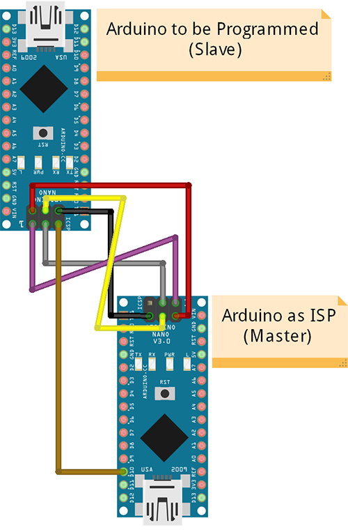

# Use an Arduino as ISP Programmer for other Arduino

I use this for my USB-broken Arduino Nano.    
This will use an Arduino to program another.    
It can also be used to burn a bootloader on __generic/clone__ Arduinos without bootloader.    

## Wiring:

## Instructions

1. Open __ArduinoISP.ino__ on Arduino IDE (or open it from File > Examples > ArduinoISP).
2. Upload-it on **MASTER** Arduino (set correct board/port).
3. Select __"Arduino as ISP"__ on __Tools > Programmer__.
4. Connect **MASTER** on **SLAVE** using wiring diagram above.
5. Open your target __*.ino*__ file (to be sent to **SLAVE**).
  * If needed burn the bootloader usinf Tools > Burn Bootloader.
6. Upload-it to **SLAVE** using `Ctrl + Shift + U` (set correct board).
  * If you upload-it from "Upload" button or regular `Ctrl + U` will send-it to **MASTER** not to **SLAVE**, if you did it go back to step 1.
